# 项目名称
# 基于 java+jsp+servlet+mysql实现的小区物业管理系统项目
基于java+jsp+servlet+mysql实现的小区物业管理系统项目，jsp+servlet小区物业管理系统项目（期末大作业，毕业设计） java小区物业管理系统，jsp+servlet小区物业管理系统，jsp小区物业管理系统，mysql小区物业管理系统， java小区物业管理系统，servlet小区物业管理系统，jsp小区物业管理系统，mysql小区物业管理系统。 java，servlet小区物业管理系统，jsp小区物业管理系统，mysql小区物业管理系统

## 安装与下载【idea与eclipse】
## 加QQ：2108657327 发项目源代码！！ 可以帮助远程调试运行好 【源码+数据库+远程调试】

## 特性/功能

java+jsp+servlet+mybatis+mysql实现的小区物业管理系统项目

期末大作业，毕业设计

mvc 模式   

具体功能如下截图：

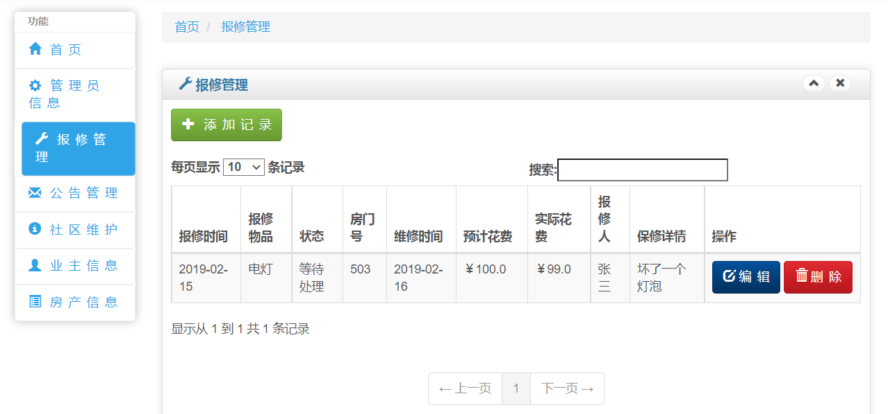

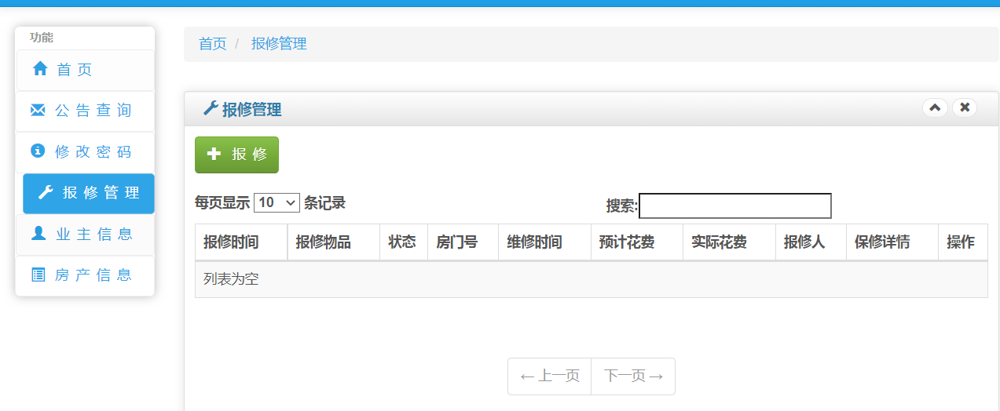

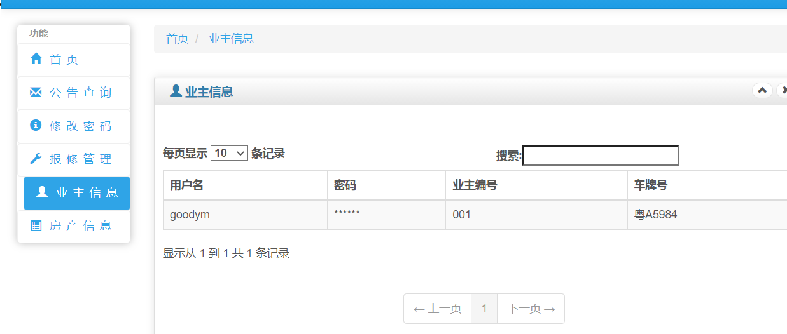

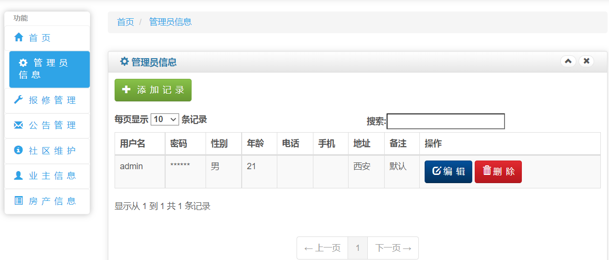

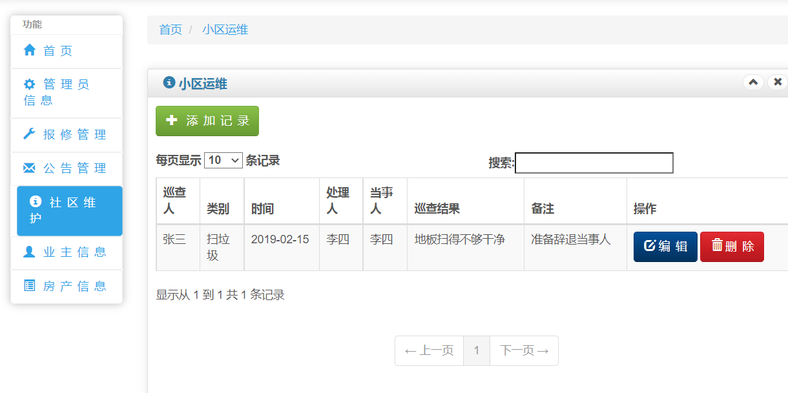

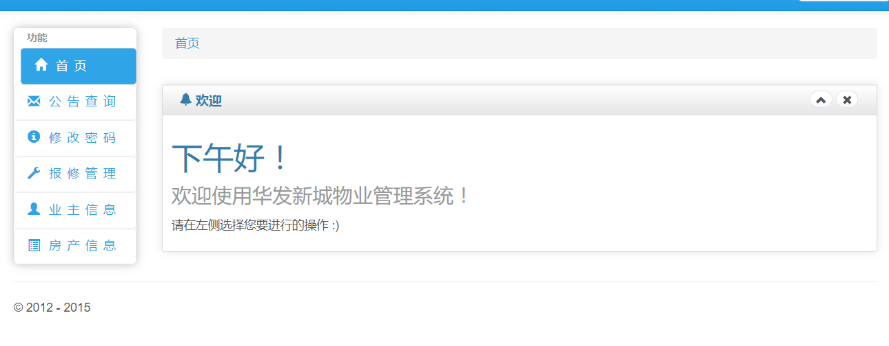

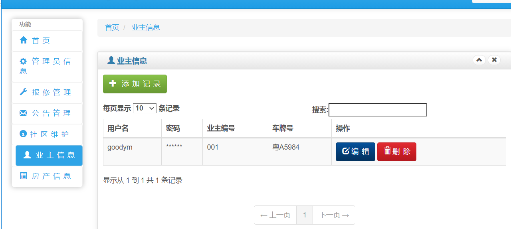

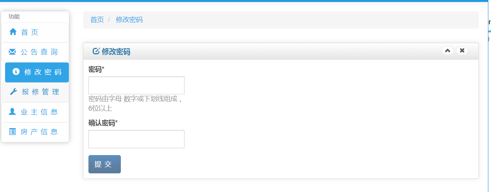

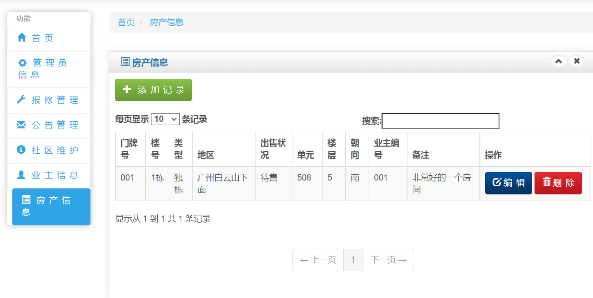

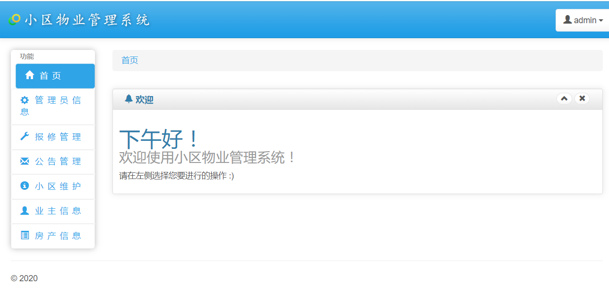

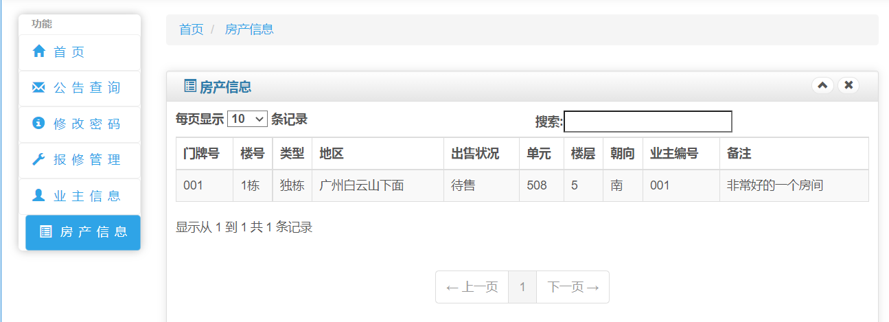

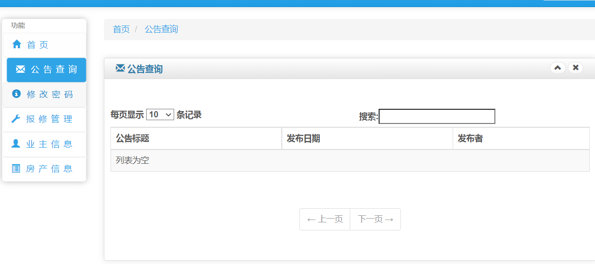

## 安装与下载【idea与eclipse均可运行】
### 加QQ：2108657327 免费获取项目源代码！！！ 
